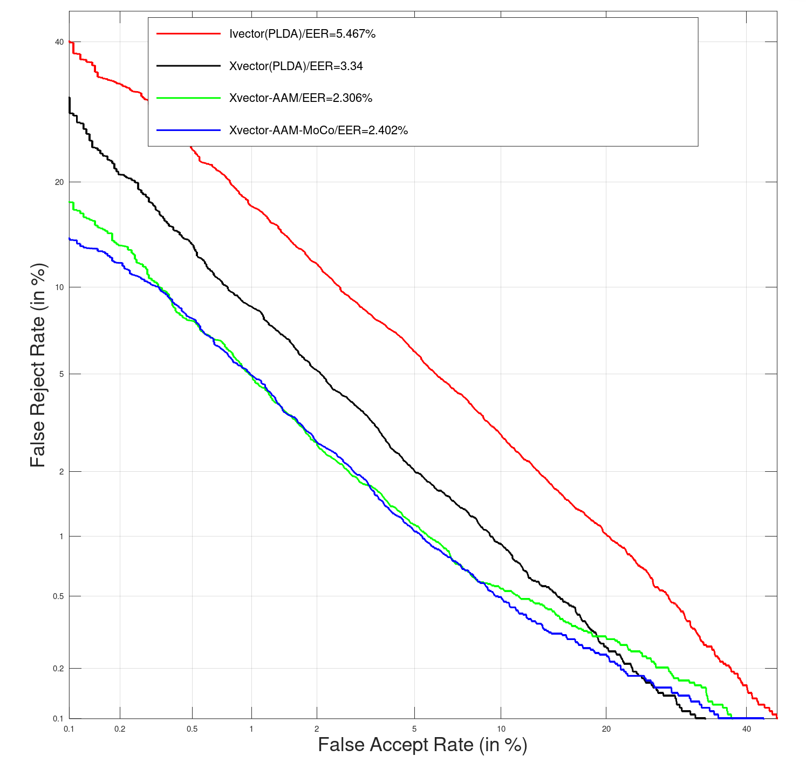

Learning Speaker Embedding with Momentum Contrast
===
# Introduction  
This repository contains the code release for our paper [Learning Speaker Embedding with Momentum Contrast](https://arxiv.org/abs/2001.01986).

The code has been developed using Kaldi and Pytorch. Kaldi is only used for feature extraction and post-processings. All neural networks are trained using Pytorch.

The purpose of the project is to make researches on neural network based speaker verification easier. We also try to reproduce some results in our papers.

# Requirements

The code is tested with the following dependencies.
* Python: 3.6.8
* Kaldi: 5.5
* kaldi-io: 0.9.4
* numpy: 1.16.4
* Pillow: 6.2.1
* scikit-learn: 0.22.2.post1
* six: 1.13.0
* tensorboardX: 1.1
* torch: 1.2.0

In addition to Kaldi, you can install the requirements via pip with:  
`pip install -r requirements.txt`

# Usage
## Step1: Train MoCo Model
To train the MoCo Model with SpecAugment, run:  
```shell
sh run_moco.sh \
  --voxceleb1_root [voxceleb1 dir] \
  --voxceleb2_root [voxceleb2 dir] \
  --rirs_noises_root [rirs_noises dir] \
  --musan_root [musan dir] \
  --data [train data dir] \
  --exp [exp dir]
```
## Step2: Train AAM-Softmax
To train AAM-Softmax with the pretrained MoCo model, run:  
```shell
sh run_xvector.sh \
  --voxceleb1_root [voxceleb1 dir] \
  --voxceleb2_root [voxceleb2 dir] \
  --rirs_noises_root [rirs_noises dir] \
  --musan_root [musan dir] \
  --moco_model [pretrained MoCo model] \
  --data [train data dir] \
  --exp [exp dir]
```
**Note:** If the MoCo Model doesn't exist, run_xvector.sh will be trained like standard Xvector recipe.  
## Step3: Evaluate the performace with trained model
After training, you can evaluate the performance on the test set, run:  
```shell
sh test.sh \
  --data [test data dir] \
  --exp [exp] \
  --dir [trained model dir] \
  --mdl [model name, default final.pkl] \
  --plda_score [apply plda if true else apply cosine score, default true]
```
# Setting
* Training data: All of Voxceleb2, plus the training portion of Voxceleb1.
* Test data: The test portion of Voxceleb1.
* For standard Xvector and MoCo, the learning rate is initially set to 1e-4 and gradually reduced to 1e-5 along the training process, for AAM-Softmax, the learning rate is initially set to 1e-5 and gradually reduced to 1e-6 along the training process.
* Chunk Size: From 200 ~ 400.
* Batch Size: 1024.
* Backend Classifier: PLDA and Cosine.
* Evaluate Model: We selet epoch=900(checkpoint\_e900.pkl) to evaluate the performance, although the AAM-Softmax trained with pretrained MoCo model would be converge faster.
# Performance
## PLDA
| Method | EER(%) | minDCT(0.01) | minDCT(0.001) |
|:------ | :----: | :----------: | :-----------: |
| Ivector| 5.467  | 0.4859 | 0.6213 |
| Xvector| 3.335 | 0.3812 | 0.6194 |
| Xvector-AAM | 2.582 | 0.3423 | 0.5907 |
|Xvector-AAM-MoCo | 2.46 | 0.2686 | 0.3907 |
## Cosine
| Method | EER(%) | minDCT(0.01) | minDCT(0.001) |
|:------ | :----: | :----------: | :-----------: |
| Ivector| 14.65 | 0.7195 | 0.8661 |
| Xvector | 7.306 | 0.5759 | 0.7545 |
| Xvector-AAM | 2.29 | 0.2641 | 0.3374 |
| Xvector-AAM-MoCo | 2.381 | 0.2285 | 0.2532 |
## DET

# Citation
If you used this code please kindly cite the following paper:  
Ke Ding, Xuanji He, Guanglu Wan. Learning Speaker Embedding with Momentum Contrast. arXiv preprint arXiv:2001.01986 (2020)
# Contact
If you have any question, please feel free to contact us:  
| Auther | E-mail |
| :----: | :----: |
| Ke Ding | dingke02@meituan.com |
| Xuanji He | hexuanji@meituan.com |
| Guanglu Wan | wanguanglu@meituan.com |

## License

The code is BSD-style licensed, as found in the [LICENSE](LICENSE) file.
